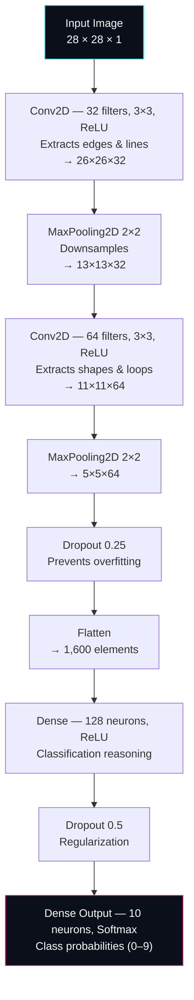
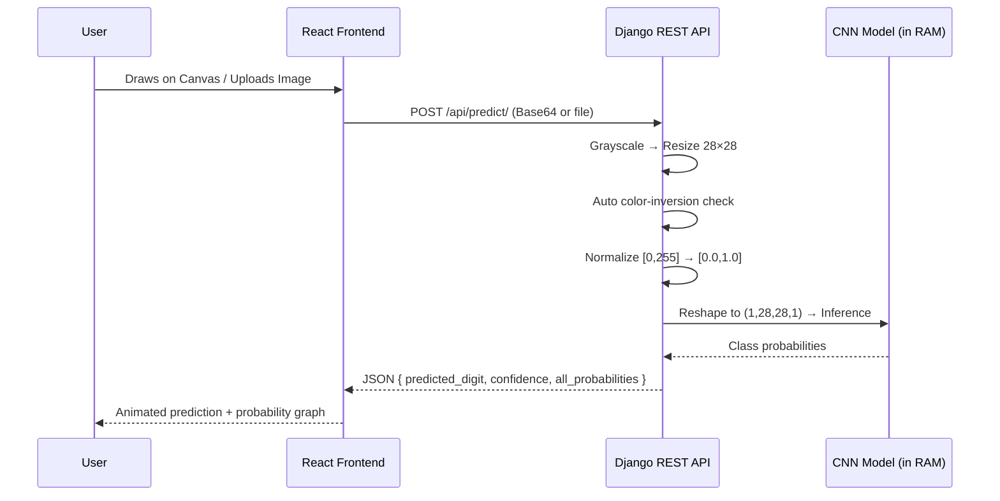

<div align="center">

# ✍️ Handwritten Digit Predictor AI

### CNN + Django REST API + React — Real-Time Digit Recognition


<br/>


</div>

---

## 📌 Overview

**Handwritten Digit Predictor AI** is a full-stack, real-time web application that recognizes handwritten digits (0–9). Users can either **draw directly on an interactive canvas** or **upload an image**, and a Convolutional Neural Network (CNN) trained on the MNIST dataset predicts the digit — along with a full class probability breakdown — in milliseconds.

The project demonstrates a complete AI product pipeline: **model training → REST API serving → interactive frontend**, wrapped in a custom Sci-Fi Glassmorphism UI.

> 🎯 **99%+ accuracy** achieved on the MNIST test dataset.

---

## 🧠 Tech Stack

| Layer | Technology | Purpose |
|---|---|---|
| 🔬 Deep Learning Engine | TensorFlow / Keras | 2D CNN built and trained, exported in native `.keras` format |
| ⚙️ Backend API | Django + Django REST Framework | Image preprocessing pipeline, in-memory model serving, `POST` API |
| 🎨 Frontend | React.js (Vite) | Glassmorphism SPA with HTML5 Canvas drawing + upload dropzone |
| 🖼️ Image Processing | OpenCV / Pillow / NumPy | Grayscale conversion, resizing, color inversion, normalization |
| 🔗 Connectivity | Axios + django-cors-headers | Secure communication between React (5173) and Django (8000) |

---

## 🏗️ CNN Architecture

Instead of a plain Dense Neural Network — which throws away spatial structure — this project uses a **CNN** to preserve 2D pixel relationships across the digit strokes.



**Training config:** Adam optimizer · `sparse_categorical_crossentropy` loss · 5 epochs on 60,000 MNIST training images.

**Exported model:** `saved_models/digit_cnn_model.keras`

---

## ⚙️ System Architecture & Request Flow



The `.keras` model is **loaded once into RAM at server startup**, eliminating reload overhead and enabling near-instant inference on every request.

---

## 🔌 API Reference

**Endpoint:** `POST /api/predict/`

Accepts either:
- A **Base64 string** (from the canvas), or
- A **multipart file** (from drag-and-drop upload)

**Response Schema:**

```json
{
  "predicted_digit": 8,
  "confidence": 98.5,
  "all_probabilities": [0.0, 0.0, 0.1, 0.0, 0.0, 0.0, 0.0, 0.0, 98.5, 1.4]
}
```

**Preprocessing pipeline (`api/views.py`):**
1. **Input parsing** — handles both Base64 and file uploads
2. **Grayscale + resize** — converts to single-channel `L` mode, resizes to 28×28
3. **Color inversion logic** — checks mean pixel brightness (`> 127`); auto-inverts light backgrounds to match MNIST's white-on-black format
4. **Normalization + reshape** — scales to `[0.0, 1.0]` and reshapes to `(1, 28, 28, 1)`

---

## 🎨 Frontend Highlights

- **Dual input system:**
  - 🖊️ Interactive **360×360 HTML5 Canvas** for real-time drawing
  - 📤 **Drag-and-drop upload** dropzone for image files
- **Design system:** Custom Sci-Fi Glassmorphism — frosted translucent panels, neon cyan (`#00e5ff`) accents, neon pink (`#ff007c`) winner highlight
- **Live visualization:** Glowing prediction badge + animated per-class probability bar graph

---

## 📁 Project Structure

```
IMAGE_PREDICTION_AI_APP/
│
├── backend/                      # Django Main Project Settings
│   ├── settings.py               # CORS config & model path
│   ├── urls.py                   # API app routes
│   └── wsgi.py
│
├── api/                          # Django REST App
│   ├── urls.py                   # '/predict/' endpoint
│   └── views.py                  # Model load + preprocessing + inference
│
├── saved_models/
│   └── digit_cnn_model.keras     # Trained CNN weights
│
├── frontend/                     # React Vite SPA
│   ├── src/
│   │   ├── App.jsx               # Canvas logic, upload handlers, state
│   │   └── App.css               # Glassmorphism styles & animations
│   └── package.json
│
├── venv/                         # Python virtual environment
├── train_cnn.py                  # CNN training script
├── visualize_cnn.py              # Matplotlib debugging visualizer
└── manage.py                     # Django CLI runner
```

---

## 🚀 Getting Started

### Backend Setup
```bash
cd backend
python -m venv venv
source venv/bin/activate      # Windows: venv\Scripts\activate
pip install -r requirements.txt
python manage.py runserver
```

### Frontend Setup
```bash
cd frontend
npm install
npm run dev
```

The app will be available at `http://localhost:5173`, connecting to the API at `http://localhost:8000`.

---

## 📊 Key Accomplishments

- ✅ **Full-stack AI integration** — bridged a deep learning model with a production-grade REST API and dynamic frontend
- ✅ **Computer vision preprocessing** — custom color inversion, spatial normalization, resolution downscaling
- ✅ **Optimized serving architecture** — model cached in RAM at startup, zero reload overhead per request
- ✅ **Custom UI/UX design** — responsive Glassmorphism interface built from scratch with CSS Grid, Flexbox, and keyframe animations

---

## 🔮 Future Improvements

- [ ] Deploy live demo (Vercel + Render)
- [ ] Add support for multi-digit sequence recognition
- [ ] Model confidence calibration & uncertainty visualization
- [ ] Mobile-responsive canvas with touch gesture smoothing

---

## 📄 License

This project is licensed under the **MIT License**.

<div align="center">

### 👤 Author

**Mohamad Alharis** — Full-Stack & AI Developer

[](https://github.com/Haaris-02)

⭐ If you found this project interesting, consider giving it a star!

</div>